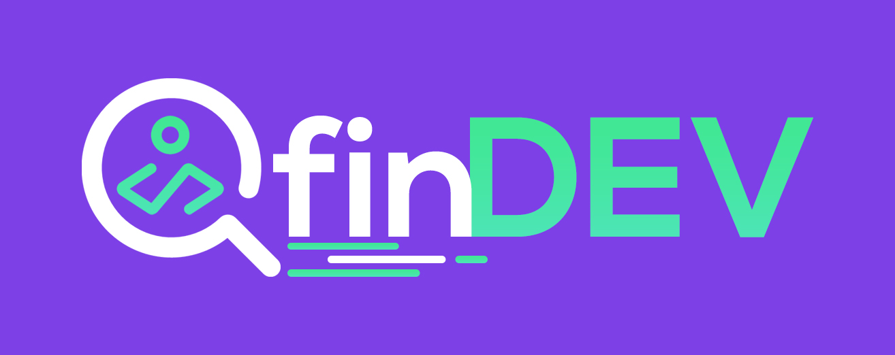

<p align="center">
  
</p>

<p align="center">
  <a href="https://pt-br.reactjs.org/"></a>
  <a href="https://nodejs.org/en/"></a>
  <a href="https://www.npmjs.com/"></a>
  <a href="https://www.mongodb.com/"></a>
  <a href="https://expo.io/"></a>
</p>

<hr>

## :bulb: Introduction

Find your best developer in your region! Search by region and techs.

## :memo: Minimal Requirements

- NodeJs 12.x
- Expo 36.x
- MongoDB 4.2.2

## 🚀 Install

```
$ git clone https://github.com/gabriel-roque/finDEV/
```

## :wrench: Configure API and MongoDB

```sh
$ cd api && npm i
$ mongod
$ npm run dev
```

## :computer: Configure WebApp

```sh
$ cd web && npm i
$ npm start
```

## :iphone: Configure MobileApp

```sh
$ cd app && npm i
$ expo start
```

> Check **web-app** in http://localhost:3000/

> Check **api** in http://localhost:3333/devs

## 👤 Authors

| Gabriel Roque                                                                       |
| ----------------------------------------------------------------------------------- |
|  |
| <a href="https://github.com/gabriel-roque">Github</a>                               |
| <a href="https://www.linkedin.com/in/gabriel-roque/">Linkedin</a>                   |

## 🤝 Contributing

Contributions, issues and feature requests are welcome!<br />Feel free to check [issues page](https://github.com/gabriel-roque/finDEV/issues).

## Show your support

Give a ⭐️ if this project helped you!
